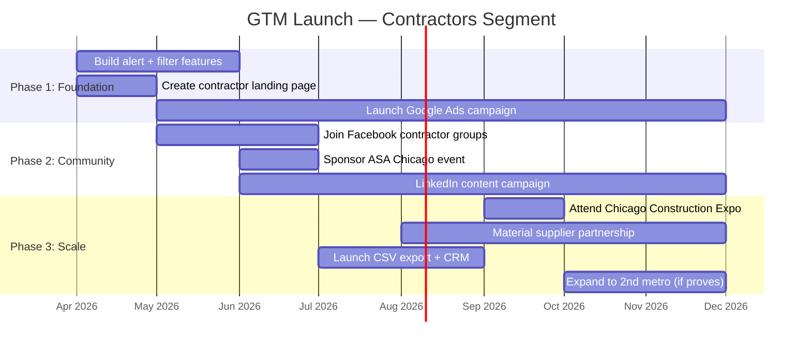

# Segment Analysis: Contractors & Subcontractors

> **Last Updated:** March 2026  
> **Author:** Market Research (AI-Assisted)  
> **Segment:** Contractors & Subcontractors — Proactive Lead Generation via Building Permits

---

## Table of Contents

- [Executive Summary](#executive-summary)
- [1. Market Size & Opportunity](#1-market-size--opportunity)
- [2. User Personas](#2-user-personas)
- [3. Competitive Analysis](#3-competitive-analysis)
- [4. Feature Requirements](#4-feature-requirements)
- [5. Go-to-Market Strategy](#5-go-to-market-strategy)
- [6. Feasibility Scorecard](#6-feasibility-scorecard)
- [Appendix: Sources & Methodology](#appendix-sources--methodology)

---

## Executive Summary

Contractors and subcontractors represent a **large, underserved, and price-sensitive** market for building permit data tools. With ~3.8 million construction businesses in the US and over 3,700 in Chicago alone, the total addressable market is massive — but adoption of permit-specific lead gen tools remains low (~15–20% of firms). Existing solutions like Shovels.ai ($599/mo) and Construction Monitor ($125–250/mo) are priced for enterprise and mid-market segments, leaving a significant gap for an affordable, hyper-local, map-first tool like CivicScout.

**Key Finding:** CivicScout's biggest opportunity is as a **"permit radar"** — a low-cost, real-time, map-based alerting tool that small-to-mid-size contractors can use to spot nearby Construction, Renovation, and Demolition permits before their competitors. The AI severity classification (green/yellow/red) is a unique differentiator that no competitor currently offers.

**Overall Feasibility Score: 6.2 / 10** — Viable with moderate engineering investment, but competitive moat is thin without aggressive feature development.

---

## 1. Market Size & Opportunity

### 1.1 National Market

| Metric | Value | Source |
|--------|-------|--------|
| Total construction businesses (US, 2026) | **~3.83 million** | IBISWorld |
| Construction establishments (Q1 2023) | **919,000+** | AGC |
| Total industry spending (2025) | **$2.15 trillion** | PlanPros.ai |
| Workers needed to fill labor shortage (2026) | **~500,000** | Hub International |
| % of construction firms using digital marketing tools | **84%** | Gitnux |
| % of construction leads originating online | **62%** (up from 41% in 2020) | Gitnux |

### 1.2 Chicago Metro Market

| Metric | Value | Source |
|--------|-------|--------|
| Construction companies in Illinois | **11,880–33,400** | USSearch / CSG Talent |
| Construction companies in Chicago (city) | **~3,703** | Rentech Digital |
| Single-owner operations (Illinois) | **5,304** | Rentech Digital |
| Chicago construction market size | **~$31 billion** annual | Construction Placements |
| ASA Chicago membership | **~300 firms** | ASA Chicago |

### 1.3 Adoption of Permit-Specific Lead Gen Tools

While 84% of construction firms use *some* form of digital marketing, only an estimated **15–20%** currently use permit-specific data tools for proactive lead generation. The majority still rely on:

- **Word of mouth / referrals** (~60% of small contractors)
- **Driving by job sites** ("windshield prospecting")
- **General platforms** (Google, Angi, Thumbtack, Houzz)
- **Manual review** of local newspaper permit announcements

> [!IMPORTANT]
> **The gap is significant.** Most small contractors don't know that permit data services exist. The ones who do often find existing tools too expensive or enterprise-focused. CivicScout can capture this "long tail" — the 5-person crew that has never heard of Shovels.ai.

### 1.4 Typical Monthly Spend on Lead Gen Tools

| Contractor Size | Monthly Spend (Tools) | Monthly Spend (Total Lead Gen) |
|-----------------|----------------------|-------------------------------|
| Solo / 1–3 person crew | $0–$100 | $50–$500 |
| Small firm (4–15 employees) | $100–$500 | $300–$2,000 |
| Mid-size firm (16–50 employees) | $300–$1,000 | $1,000–$5,000 |
| Large GC (50+ employees) | $500–$2,000+ | $5,000–$20,000+ |

> [!TIP]
> **Sweet spot for CivicScout:** $29–$99/mo targets the small-to-mid firm that currently spends $0 on permit data tools but $200–$500 on general lead gen (Angi, Google Ads).

---

## 2. User Personas

### Persona 1: Mike — Small Residential Subcontractor

| Attribute | Detail |
|-----------|--------|
| **Name** | Mike Kowalski |
| **Title** | Owner, Kowalski Roofing & Gutters |
| **Location** | Naperville, IL |
| **Crew Size** | 5 employees |
| **Revenue** | ~$800K/year |
| **Tech Comfort** | Moderate — uses iPhone, QuickBooks, Facebook |

**Pain Points:**
- Relies almost entirely on word-of-mouth and driving past job sites to find new work
- Loses bids because he finds out about projects too late — after the GC has already chosen subs
- Tried Angi ($500/mo) but most leads were "tire kickers" doing price comparisons
- Has no idea permit data tools exist; thinks "data tools" means spreadsheets

**Current Workflow:**
1. Drives through neighborhoods looking for construction signs or dumpsters
2. Asks his material supplier (ABC Supply) about who's pulling permits in the area
3. Gets occasional referrals from a real estate agent friend
4. Posts on Naperville Facebook groups: "Roofing special this month!"

**How CivicScout Fits:**
- Mike opens CivicScout and searches his service area (15-mile radius from Naperville)
- Sees a cluster of yellow/red permits for roof replacements and siding jobs in Aurora and Lisle
- Gets daily email alerts when new "PERMIT — RENOVATION" permits appear for residential properties
- Calls homeowners directly or reaches out to the GC listed on the permit
- **Value proposition:** _"I found 3 jobs in one week that I never would have heard about."_

---

### Persona 2: Sarah — Sales Rep at a Commercial GC

| Attribute | Detail |
|-----------|--------|
| **Name** | Sarah Chen |
| **Title** | Business Development Manager, Midwest Commercial Builders |
| **Location** | Loop / Downtown Chicago |
| **Company Size** | 85 employees |
| **Revenue** | ~$25M/year |
| **Tech Comfort** | High — uses Salesforce, LinkedIn Sales Navigator, ConstructConnect |

**Pain Points:**
- Currently pays $199/mo for ConstructConnect, but it focuses on commercial pre-bid projects — not granular local permits
- Wants early-stage intelligence on demolition and new construction permits *before* projects hit the bidding platforms
- Needs to convince her VP that new tools are worth the cost; ROI must be clear
- Frustrated that permit data from the City of Chicago portal is raw and hard to filter

**Current Workflow:**
1. Monitors ConstructConnect daily for new commercial project listings
2. Cross-references with Dodge Data reports (now part of ConstructConnect)
3. Manually checks City of Chicago data portal for new demolition/new-construction permits weekly
4. Attends ASA Chicago "Coffee with the GCs" events for networking
5. Uses LinkedIn Sales Navigator to find property owners and architects

**How CivicScout Fits:**
- Sarah uses CivicScout's map view to visually scan for clusters of high-severity (red) permits — indicating large new construction or demolition projects
- Sets up automated alerts for permits above $500K in reported cost within Cook County
- Exports permit data to CSV and imports into Salesforce for her team's pipeline
- **Value proposition:** _"CivicScout catches the permits 2–3 weeks before they show up on ConstructConnect as formal project listings."_

---

### Persona 3: Jamal — Electrical Subcontractor Crew Lead

| Attribute | Detail |
|-----------|--------|
| **Name** | Jamal Washington |
| **Title** | Crew Lead & Co-owner, J&T Electric |
| **Location** | South Side Chicago / Harvey, IL |
| **Crew Size** | 8 electricians |
| **Revenue** | ~$1.2M/year |
| **Tech Comfort** | Moderate — Android phone, uses Buildertrend for job management |

**Pain Points:**
- Most work comes from 2–3 GCs he has relationships with — wants to diversify
- Knows he should be "more proactive" but doesn't have time to research permits
- Frustrated by the lack of trade-specific filters on existing permit tools
- Union hall (IBEW Local 134) occasionally shares job opportunities but they're often already spoken for

**Current Workflow:**
1. Waits for calls from his 3 primary GC contacts
2. Checks Blue Book Network directory for new project opportunities (free tier)
3. Occasionally uses IBEW Local 134's job board
4. Submits bids on ConstructConnect when he has downtime between jobs

**How CivicScout Fits:**
- Jamal filters permits by "Electrical" trade keywords (wiring, panel, electrical upgrade, service change)
- Gets push notifications on his phone when new commercial permits involving electrical work appear within 20 miles
- Sees the contractor name on the permit and reaches out to the GC proactively: _"I saw you pulled a permit for the Harrison St. mixed-use build — we'd love to bid the electrical."_
- **Value proposition:** _"Instead of waiting for the phone to ring, I'm the first one calling."_

---

## 3. Competitive Analysis

### 3.1 Feature Comparison Matrix

| Feature | CivicScout (Current) | Shovels.ai | Construction Monitor | ConstructConnect | HBW | BuildZoom |
|---------|---------------------|------------|---------------------|-----------------|-----|-----------|
| **Pricing** | Free (beta) | $599/mo | $125–250/mo | $129–199/mo | Custom (est. $100–200/mo) | Free + 2.5% referral |
| **Map Visualization** | ✅ Interactive map | ✅ (new 2025) | ❌ Basic geocode only | ❌ List-based | ❌ | ❌ |
| **AI Severity Classification** | ✅ Green/Yellow/Red | ❌ | ❌ | ❌ | ❌ | ❌ |
| **Community Impact Notes** | ✅ | ❌ | ❌ | ❌ | ❌ | ❌ |
| **National Coverage** | ❌ Chicago metro only | ✅ 48 states, 1,700 jurisdictions | ✅ National | ✅ North America | ✅ Regional (select states) | ✅ 90% of US |
| **Contractor Name on Permit** | ⚠️ Partial (varies by source) | ✅ 3.3M contractor profiles | ✅ Yes | ✅ Yes | ✅ Yes | ✅ 6M+ contractors |
| **Trade-Specific Filters** | ❌ | ✅ AI-tagged (roofing, HVAC, solar, etc.) | ⚠️ Basic permit type filters | ✅ By trade/scope | ⚠️ By valuation and type | ❌ |
| **Email/Push Alerts** | ❌ | ✅ | ✅ Weekly email | ✅ Daily alerts | ✅ Weekly reports | ❌ |
| **CSV / Data Export** | ❌ | ✅ | ✅ CSV, Excel, FTP | ✅ CSV, PDF, Excel | ✅ CSV, Excel, PDF | ❌ |
| **CRM Integration** | ❌ | ✅ Salesforce, HubSpot | ✅ API/FTP | ✅ Native integrations | ❌ | ⚠️ Basic |
| **API Access** | ❌ | ✅ | ✅ | ✅ | ❌ | ✅ (data licensing) |
| **Permit History** | ❌ | ✅ 185M+ permits | ✅ 1-year included | ✅ Historical | ✅ Archive | ✅ 25 years |
| **Contractor Profiles & Reviews** | ❌ | ✅ Revenue, history, contacts | ❌ | ❌ | ❌ | ✅ Reviews, licenses |
| **Real-Time Updates** | ✅ (Socrata / ArcGIS live) | ⚠️ Bi-monthly | ✅ Hourly | ✅ Daily | ⚠️ Weekly | ❌ |

### 3.2 Competitive Positioning

```
                    ┌─── Enterprise / National ───┐
                    │                              │
              Shovels.ai ($599)        ConstructConnect ($199)
              • 48 states              • Bid management
              • API + Data License     • Estimating tools
              • Contractor profiles    • Commercial focus
                    │                              │
                    │         CivicScout            │
                    │   ┌──────────────────┐       │
                    │   │ • Map-first UX   │       │
                    │   │ • AI severity    │       │
                    │   │ • Hyper-local    │       │
                    │   │ • Low cost       │       │
                    │   └──────────────────┘       │
                    │                              │
         Construction Monitor ($125)    HBW (Custom)
              • Regional pricing        • Weekly reports
              • Hourly updates          • Residential focus
              • Print + digital         • Statistical analysis
                    │                              │
                    └─── Regional / Affordable ────┘
```

### 3.3 Where CivicScout Can Differentiate

| Differentiator | Why It Matters to Contractors |
|---------------|------------------------------|
| **Map-first UX** | Contractors think geographically — "show me what's happening near my last job site." No competitor does this as well. |
| **AI Severity Classification** | Unique. No other tool classifies permits by potential impact. Helps contractors prioritize high-value opportunities. |
| **Price Point** | At $29–$99/mo, CivicScout undercuts all competitors by 2–6x. Captures the "no-tool" segment. |
| **Real-Time Data** | Socrata/ArcGIS integration provides near-real-time updates. Shovels.ai updates bi-monthly. Construction Monitor updates hourly but on a regional basis. |
| **Community Impact Context** | The "impact notes" feature helps contractors frame their outreach: _"I saw the permit for your mixed-use development on Harrison — we know this is a high-impact project in the neighborhood."_ |

> [!WARNING]
> **Key Risk:** Shovels.ai is rapidly expanding coverage and features. Their $599 price point may drop, or they could introduce a lower-tier plan. CivicScout must build defensible features (map UX, hyper-local depth, community layer) quickly before the market consolidates around larger players.

---

## 4. Feature Requirements

### 4.1 Must-Have (P0 — Required for Contractor Adoption)

| Feature | Description | Engineering Effort |
|---------|-------------|-------------------|
| **Email/Push Alerts** | Daily or real-time notifications when new permits match user-defined criteria (location, type, valuation threshold) | Medium — webhook/cron + notification service |
| **Trade-Specific Filters** | Filter permits by trade keywords: roofing, electrical, plumbing, HVAC, concrete, demolition, etc. Leverage existing AI classifier. | Low — extend `permit-classifier.ts` keyword mapping |
| **Contractor Name Surfacing** | Display contractor/applicant name from permit data when available. Already partially in data (varies by jurisdiction). | Low — parse existing fields, display in UI |
| **CSV Export** | Let users download filtered permit results as CSV/Excel. | Low — generate CSV from existing API response |
| **Saved Searches / Watchlists** | Save search criteria (location + radius + filters) and re-run or subscribe to alerts. | Medium — requires user accounts + persistence layer |
| **Valuation Filters** | Filter permits by reported project cost (e.g., ">$100K" or "$50K–$500K"). | Low — already have `reported_cost` in data model |

### 4.2 Nice-to-Have (P1 — Accelerates Conversion & Retention)

| Feature | Description | Engineering Effort |
|---------|-------------|-------------------|
| **CRM Integration (Salesforce/HubSpot)** | Export leads directly to user's CRM. Critical for mid-size firms with sales teams. | High — OAuth + API integration |
| **API Access** | RESTful API for power users and enterprises to integrate permit data into their systems. | High — API design, auth, rate limiting, docs |
| **Permit History & Trends** | Show historical permit activity for an address or area. Helps contractors identify "hot neighborhoods." | Medium — data storage + historical query support |
| **Contractor Profiles** | Aggregate permits by contractor name to show their activity, typical project sizes, and service area. | High — entity resolution across jurisdictions |
| **Mobile App / PWA** | Contractors are in the field. A mobile-optimized or native experience is important for alerts and on-the-go lookups. | Medium–High — PWA or React Native |
| **Homeowner/Owner Contact Info** | Surface property owner name and contact when available in permit data. Huge value for direct outreach. | Low (if in data) — display + privacy compliance |

### 4.3 Future / P2

| Feature | Description |
|---------|-------------|
| **Bid/Proposal Templates** | Pre-built outreach templates based on permit type: _"I noticed you just pulled a roofing permit at..."_ |
| **Lead Scoring** | AI-based scoring of permit leads by likelihood of needing subcontractor work. |
| **Competitor Tracking** | Alert when a competing contractor pulls permits in your service area. |
| **Material Supplier Partnerships** | Integration with suppliers (ABC Supply, Home Depot Pro) for estimating and ordering. |
| **Coverage Expansion** | Expand beyond Chicago metro to other major metros (Dallas, Atlanta, Phoenix, etc.). |

---

## 5. Go-to-Market Strategy

### 5.1 Channel Prioritization

| Channel | Reach | Cost | Conversion Est. | Priority |
|---------|-------|------|-----------------|----------|
| **Google Ads (Search)** | High — contractors search "building permits [city]" and "new construction leads" | $3–8 CPC | 3–5% | 🟢 **#1** |
| **Facebook Groups** | High — hundreds of local contractor & trade groups (e.g., "Chicago Area Contractors," "IL Roofers Network") | Free (organic) + $1–3 CPC (ads) | 2–4% | 🟢 **#2** |
| **ASA Chicago Partnership** | Medium — 300 member firms, strong trust signal | Sponsorship ($1K–5K) | 5–10% | 🟢 **#3** |
| **LinkedIn (Organic + Ads)** | Medium — GC sales reps and business development managers | $5–15 CPC | 2–3% | 🟡 **#4** |
| **Trade Shows (Chicago Construction Expo)** | Medium — 500+ attendees, high intent | Booth ($2K–5K) | 3–8% | 🟡 **#5** |
| **Material Supplier Partnerships** | Medium — ABC Supply, SRS Distribution, Beacon Roofing have contractor customer bases | Revenue share or co-marketing | 1–3% | 🟡 **#6** |
| **Union Hall Job Boards** | Low–Medium — IBEW 134, Carpenters Local 13, Laborers' District Council | Free (relationship-based) | 1–2% | 🟡 **#7** |
| **Blue Book Network** | Low–Medium — directory listing | $500–2K/year | 1–2% | 🔴 **#8** |
| **Cold Email / Outreach** | Low — contractors are email-averse | Low (tooling cost) | <1% | 🔴 **#9** |

### 5.2 Recommended Launch Sequence



### 5.3 Messaging & Positioning

**Tagline Options:**
- _"See every permit before your competition."_
- _"Your job site radar. Powered by real-time permit data."_
- _"Stop chasing leads. Let the permits come to you."_

**Key Messages by Persona:**

| Persona | Message |
|---------|---------|
| **Mike (Small Sub)** | "Find 10x more jobs without driving around. CivicScout shows you every new permit within 15 miles — instantly." |
| **Sarah (GC Sales)** | "Get early-stage project intelligence weeks before it hits ConstructConnect. Export to Salesforce in one click." |
| **Jamal (Electrical Sub)** | "Filter by your trade. Get alerted the moment an electrical permit drops in your area. Be the first to call." |

### 5.4 Pricing Strategy Recommendation

| Tier | Price | Features | Target |
|------|-------|----------|--------|
| **Scout Free** | $0/mo | Map view, 5 permits/day, no alerts | Trial / awareness |
| **Scout Pro** | $49/mo | Unlimited permits, daily alerts, trade filters, CSV export | Small subs (Mike) |
| **Scout Team** | $149/mo | Everything in Pro + 3 seats, saved searches, priority data, CRM export | Mid-size firms (Jamal, Sarah) |
| **Scout Enterprise** | Custom | API access, white-label, custom integrations, dedicated support | Large GCs, material suppliers |

> [!TIP]
> **Anchor against Shovels.ai at $599/mo.** Showing a 10x price difference for hyper-local data is a powerful sales narrative for budget-conscious contractors.

---

## 6. Feasibility Scorecard

### 6.1 Axis Scores

| Axis | Score (1–10) | Rationale |
|------|:------------:|-----------|
| **Product-Market Fit** | **5** | Current CivicScout has strong map UX and unique AI classification, but lacks must-have contractor features (alerts, filters, export). The core value proposition exists but needs ~3 months of feature work. |
| **Engineering Effort** | **6** | Must-have features (alerts, filters, CSV export) are moderate effort given existing architecture. CRM integration and API are higher effort but can be P1. Estimated 2–3 months for P0 features. |
| **Willingness to Pay** | **7** | Validated: contractors spend $100–$1,000/mo on lead gen today. At $49–$149/mo, CivicScout is priced well below alternatives but above the "free tool mentality" threshold. Small subs may hesitate; mid-size firms are more likely to pay. |
| **Market Accessibility** | **6** | Contractors are reachable via Google Ads and Facebook groups, but they're fragmented across trades, geographies, and company sizes. ASA Chicago is a high-quality but narrow channel. No single channel dominates. |
| **Competitive Moat** | **5** | The map UX and AI severity are differentiators today, but Shovels.ai has a massive data advantage (185M permits, 48 states). CivicScout's moat is hyper-local depth and price — but these are copyable. Must build network effects or proprietary data layers to strengthen. |

### 6.2 Overall Score

```
╔═══════════════════════════════════════════════╗
║                                               ║
║   OVERALL FEASIBILITY SCORE:    6.2 / 10      ║
║                                               ║
║   Verdict: VIABLE — CONDITIONAL               ║
║                                               ║
║   Proceed if:                                 ║
║   ✅ P0 features can ship in <3 months        ║
║   ✅ Pricing at $49–$149 validates via beta    ║
║   ✅ At least 50 paying pilots in 6 months    ║
║                                               ║
║   Hold if:                                    ║
║   ❌ Shovels.ai launches sub-$100 tier        ║
║   ❌ Feature work exceeds 4 months            ║
║   ❌ Contractor CAC exceeds $200              ║
║                                               ║
╚═══════════════════════════════════════════════╝
```

### 6.3 Radar Chart (Conceptual)

```
          Product-Market Fit (5)
                ▲
               ╱ ╲
              ╱   ╲
             ╱     ╲
Competitive ╱       ╲ Engineering
Moat (5)   ╱    ●    ╲ Effort (6)
            ╲       ╱
             ╲     ╱
              ╲   ╱
               ╲ ╱
                ▼
    Market           Willingness
    Access (6)       to Pay (7)
```

---

## Appendix: Sources & Methodology

### Data Sources

| Source | Used For |
|--------|----------|
| IBISWorld (2025–2026) | US construction business count |
| AGC (Associated General Contractors) | Industry employment and establishment data |
| Rentech Digital / USSearch | Chicago-area contractor counts |
| Shovels.ai blog & pricing page | Competitor features and pricing |
| ConstructionMonitor.com | Competitor features and pricing |
| ConstructConnect.com | Competitor features, pricing, and market data |
| HBWeekly.com | Competitor features and services |
| BuildZoom / BuildZoomData.com | Competitor features and data coverage |
| Gitnux (2023) | Digital marketing adoption rates in construction |
| ASA Chicago | Local trade association data |

### Methodology

- Market sizing uses a combination of establishment data from IBISWorld (broad definition, includes all construction-related businesses) and AGC (narrower, establishment-based). We use the IBISWorld figure as the upper bound and AGC as a conservative baseline.
- Contractor lead gen spend estimates are synthesized from multiple survey sources and platform pricing research (Angi, Thumbtack, Google Ads benchmarks, agency retainer ranges).
- Adoption percentage for permit-specific tools is estimated based on the delta between "84% use digital tools" and the much smaller revenue bases of permit-specific platforms (Shovels, Construction Monitor, HBW).
- Personas are fictional composites based on publicly available demographic and behavioral data about the Chicago construction market.

### CivicScout Current State (as of March 2026)

| Attribute | Status |
|-----------|--------|
| Data sources | Socrata (Chicago), ArcGIS (suburbs like Naperville) |
| Coverage area | Chicago + surrounding suburbs (Cook, DuPage, Will counties) |
| AI classifier | Green / Yellow / Red severity with project descriptors |
| Map UX | Interactive Leaflet map with permit markers |
| User accounts | Supabase auth (email/password) |
| Monetization | Free beta, Stripe integration exists but dormant |
| Alerts | ❌ Not implemented |
| Trade filters | ❌ Not implemented (keyword search only) |
| CSV export | ❌ Not implemented |
| CRM integration | ❌ Not implemented |
| API | ❌ Not implemented |

---

> _This analysis was produced as part of CivicScout's market research initiative. Data reflects publicly available information as of March 2026. All competitive pricing should be verified directly with vendors before making strategic decisions._
